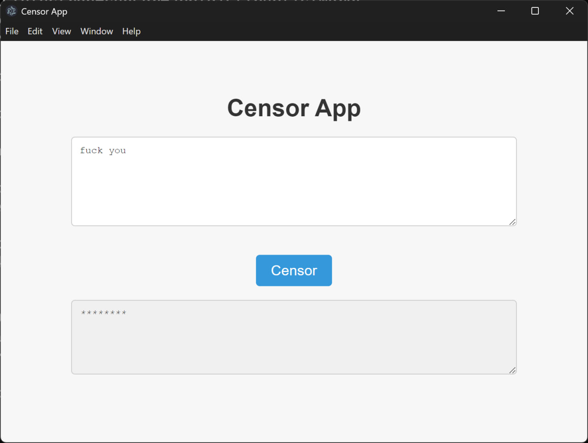

# Electron Censor App

The Electron Censor App is a simple desktop application built with Electron.js that allows users to censor specific words in a given text. Users can input text, and the app will automatically replace any specified words with asterisks (`*`).



## Features

- Load a list of words (from text files) to censor.
- Replace censored words with asterisks in real-time as the user presses the "Censor" button.
- Supports both Persian and English words.
- Built using Electron for cross-platform compatibility.

## Installation

To run the Electron Censor App locally, follow the steps below:

1. Clone this repository to your local machine:
   ```bash
   git clone https://github.com/BaseMax/electron-censor-app.git
   ```

2. Navigate into the project directory:

   ```bash
   cd electron-censor-app
   ```

3. Install the dependencies using npm:

   ```bash
   npm install
   ```

4. Build the app:

   ```bash
   npm run build
   ```

Run the app:

   ```bash
   npm run start
   ```

This will launch the Electron app and open a window where you can enter text to censor.

## Usage

The app loads words to censor from text files (`persian.txt` and `english.txt`).

Once the app is loaded, you can enter text into the provided textarea.

Clicking the "Censor" button will replace any matching words in the input text with asterisks (*), and the censored text will appear in the output textarea.

## Development

To contribute or modify the app, you can make changes to the source code located in the `src/` directory. After making changes, you can rebuild the app using Electron's build tools.

Start the app in development mode:

```bash
npm run dev
```

This will open the app in a development environment where you can test changes in real-time.

### License

This project is licensed under the MIT License.

Copyright (c) 2024, Max Base
